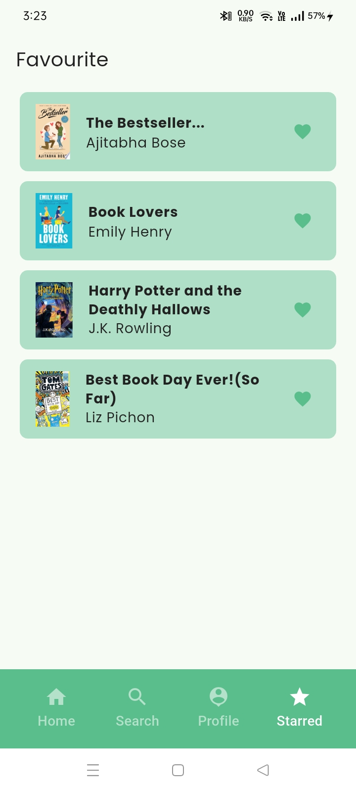

# Kitaabe - World of Books

Kitaabe is an online book reading Flutter app designed for book lovers to search, read, and manage books seamlessly. It leverages Firebase for backend services and Google Sign-In for authentication, providing a smooth and real-time user experience.

---

## Features

- **Online Book Reading**: Search and read books online with real-time updates.
- **User Authentication**: Secure sign-in using Google authentication.
- **Clean UI/UX**: Intuitive navigation and user-friendly interface.
- **Genre-wise Book Browsing**: Explore books by different genres.
- **Bookmark & Favorites**: Save your favorite books for quick access.

---

## Technologies Used

- **Flutter**: For building a cross-platform mobile and web app.
- **Dart**: Primary programming language.
- **Firebase**: Firestore for real-time database, Firebase Authentication for user login.
- **Google Sign-In**: For user authentication.
- **REST APIs**: For backend communication (where applicable).
- **Git & GitHub**: Version control and repository hosting.
- **Tools**: VS Code, Android Studio.

---

## How to Run the App

1. **Clone the repository:**
   bash git clone https://github.com/Rawat-Arjun/kitaabe-World_of_Books.git

   cd kitaabe-World_of_Books

3. **Install dependencies:**
   bash
   flutter pub get

4. **Configure Firebase:**
   * Add your Firebase config files (`google-services.json` for Android and `GoogleService-Info.plist` for iOS) into the respective platform folders.
   * Set up Firebase project and enable Firestore and Authentication.

5. **Run the app:**
   bash
   flutter run

---

## Project Structure Overview

* **lib/**: Main source code for the app.

* **components/**: Reusable UI widgets and components.
* **screens/**: Different screens such as authentication, home, onboarding, search, and splash screen.
* **services/**: API services, controllers, and storage helpers.
* **assets/**: Contains images and animation files.
* **android/**, **ios/**, **web/**, **linux/**, **windows/**, **macos/**: Platform-specific folders.
* **pubspec.yaml**: Flutter project configuration and dependencies.

---

## Future Improvements

* Add more book genres and categories.
* Implement offline reading support.
* Enable user reviews and ratings.
* Add social sharing features.
* Improve UI animations and responsiveness.

---

## Screenshots

Below are key screens from the app to showcase functionality and design:

### Splash Screen

*The opening screen displaying the app logo while loading.*

---

### Auth Screen

*Allows users to sign in using Google or email.*

---

### Home Screen (Book List)

*Browse and explore a wide variety of books.*

---

### Book Detail Screen

*Detailed view of a selected book with description and options.*

---

### Book Reading Screen

*Read books online with a clean and distraction-free UI.*

---

### Search Functionality

*Search for books by title, author, or genre.*

---

### Add to favourite

*Save notes and bookmark favorite books for easy access.*

---

## Contact

Feel free to reach out via:

* Email: [arjunrawat1212@gmail.com](mailto:arjunrawat1212@gmail.com)
* GitHub: [github.com/Rawat-Arjun](https://github.com/Rawat-Arjun)
* LinkedIn: [linkedin.com/in/arjunrawat](https://linkedin.com/in/arjunrawat)

---

Thank you for checking out Kitaabe - World of Books! 
